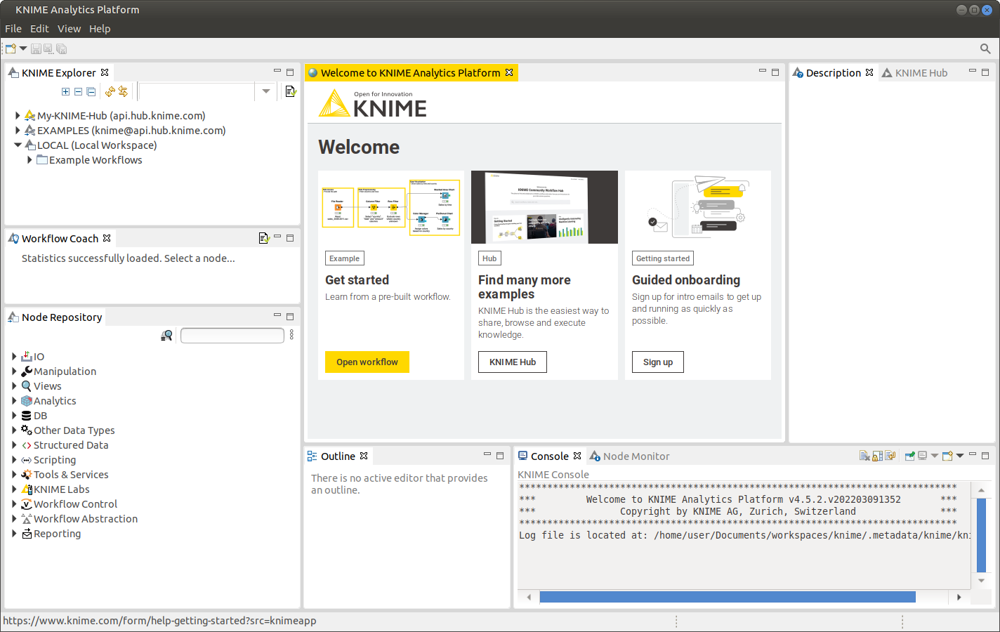
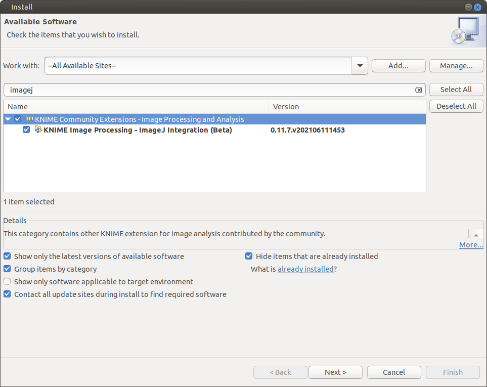
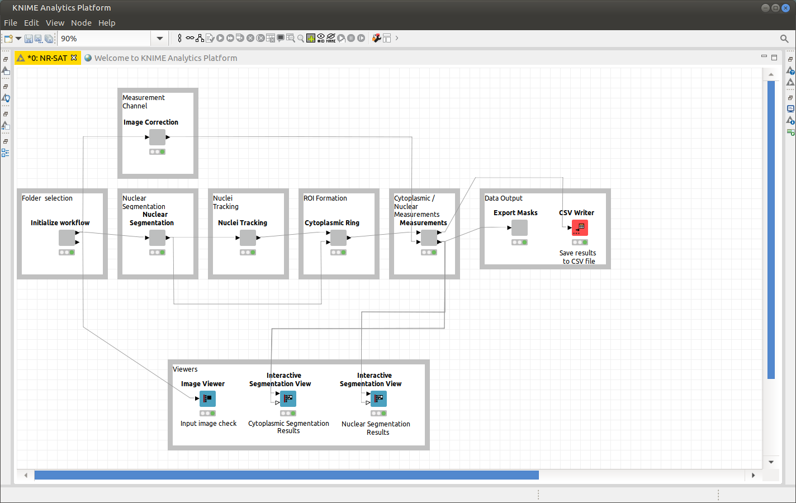

KNIME Image processing tutorial
===

## 1. Download and install KNIME

Visit www.knime.com and download KNIME for your platform (Windows, MacOS and Linux are supported).

## 2. Launch KNIME

Launch KNIME and setup up your workspace directory. KNIME will open with several side panels along with a  welcome screen. How to use each of these panels is beyond the scope of this tutorial. For more information on editing/developing workflows please visit the [KNIME development documentation](https://www.knime.com/learning). In this tutorial we will use the `KNIME Explorer` side panel to select and load a workflow.

## 3. Load a workflow

You can load the workflow by visiting the KNIME hub at [hub.knime.com](https://hub.knime.com) and using the "Drag Workflow" feature to drag the workflow into the `KNIME Explorer` side panel. Alternatively you can import a workflow file directly into KNIME (**File** > **Import KNIME Workflow...**). Once the workflow as been added to the KNIME workspace, double click the workflow to open and load it.

Before you can begin using the HIV RGB workflow, several dependencies need to be resolved. Click `Yes` to automatically install most of the required extensions.

Note that you may receive an error when installing the required extensions:

Click **Yes** to install the required extensions. If you still recieve an error, you may need to add an additional software source. Click **Help** > **Install New Software...** to open the software management window.

Next click the **Manage...** to open the software sources management window.

Click the check box next to the `KNIME Community Extensions (Experimental)` software site. To accept this settings click **Apply and Close**.

In the `Work with:` pull down menu select `--All Available Sites--`. Next search for `imagej` and select the `KNIME Image Processing - ImageJ Integration (Beta)` and install the software package.

After installing the ImageJ integration package, restart KNIME and open the workflow again. If there are still missing dependencies, you will receive additional notification (_e.g._ Trackmate Tracker).

## 4. Load data into the workflow

To load data into the workflow, right click the first node `Folder Selection` and click **Configure...**.

Enter the path to your data and enter the file name extension (_e.g._ tif, nd2, avi) then click **OK**.

Once your data has been loaded the node status indicator will change from `Red` to `Yellow`.

The workflow is now ready to run.

## 5. Running the workflow

To run workflows click either the single green play button (runs only the selected node and the nodes before the selected node) or the double green play button (runs all nodes in the workflow).

Once your workflow has completed, each node should have a green status. If an error has occurred, look for red nodes with an error icon.

If you did not configure the `Data Output` node, it will fail once the data gets to this node. Simply configure the node to export the data to your desired location and re-run the the node. Your data is not lost if an error occurs during the workflow.
